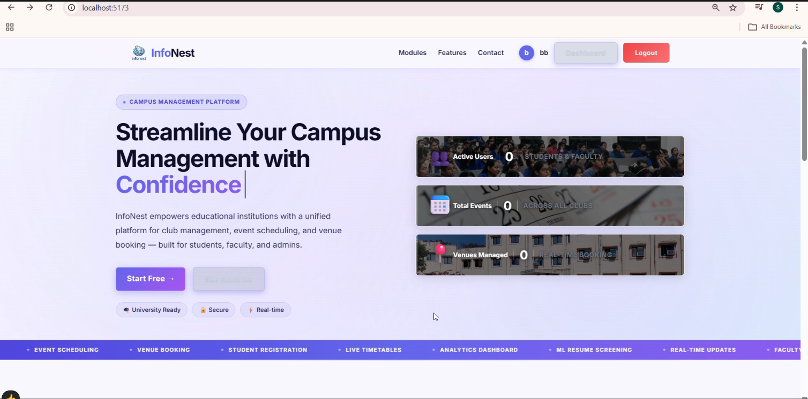

# 🎓 College Resource Management System (CRMS)

A full-stack web application designed to streamline **club management, venue booking, and academic scheduling** within a college ecosystem.

The system provides secure role-based dashboards with ERP API integration for real-time academic management.

---

## 🚀 Project Overview

### 📌 Core Modules
- 🎯 Club Management Module
- 🏢 Venue Management Module
- 📅 Schedule Management Module

### 📊 Role-Based Dashboards
- 👩‍🎓 Student Dashboard
- 👩‍🏫 Faculty Dashboard
- 🏛 Club Official Dashboard
- 🛠 Admin Dashboard
- 🏢 Office Dashboard

---

# 🧩 Module Details

## 1️⃣ Club Management Module

Manages club events, recruitment, and role assignments.

### 👩‍🎓 Student
- Register for club events  
- View all available clubs  
- Apply for club recruitment  
- View teacher schedules  
- Track live teacher location  

### 👩‍🏫 Faculty
- View clubs  
- Register for events  
- View personal schedule  
- Book venues  

### 🏛 Club Official
- Add / Remove events  
- Recruit club members  
- View schedules  
- Book venues  

### 🛠 Admin
- Create / Edit / Delete clubs  
- Assign club officials  
- Manage overall club structure  

---

## 2️⃣ Venue Management Module

Handles venue allocation and booking workflows.

### 👩‍🏫 Faculty & 🏛 Club Official
- Book venues for events  

### 🏢 Office
- Add new venues  
- Delete venues  
- Manage venue database  

---

## 3️⃣ Schedule Management Module

Integrated with ERP system for real-time academic scheduling.

### 🏢 Office
- Update teacher schedules via ERP API integration  

### 👩‍🎓 Student
- View teacher schedule  
- Track live teacher location  

### 👩‍🏫 Faculty
- View personal schedule  

---

# 🔐 Role-Based Access Control

- Secure authentication  
- Permission-based dashboards  
- Controlled data access  

---

# 🛠 Tech Stack

### Frontend
- React.js  
- HTML5  
- CSS3  
- JavaScript  

### Backend
- Spring Boot  
- REST APIs  

### Database
- PostgreSQL  

### Integration
- ERP API Integration  

---

# 📸 UI Screenshots

> Replace the image paths below with your actual screenshot folder.

---

# 🌟 Key Highlights

- ✔ 5 Role-Based Dashboards  
- ✔ ERP API Integration  
- ✔ Venue Booking Workflow  
- ✔ Club Recruitment Management  
- ✔ Real-Time Schedule Tracking  
- ✔ Secure Role-Based Authentication  

---
